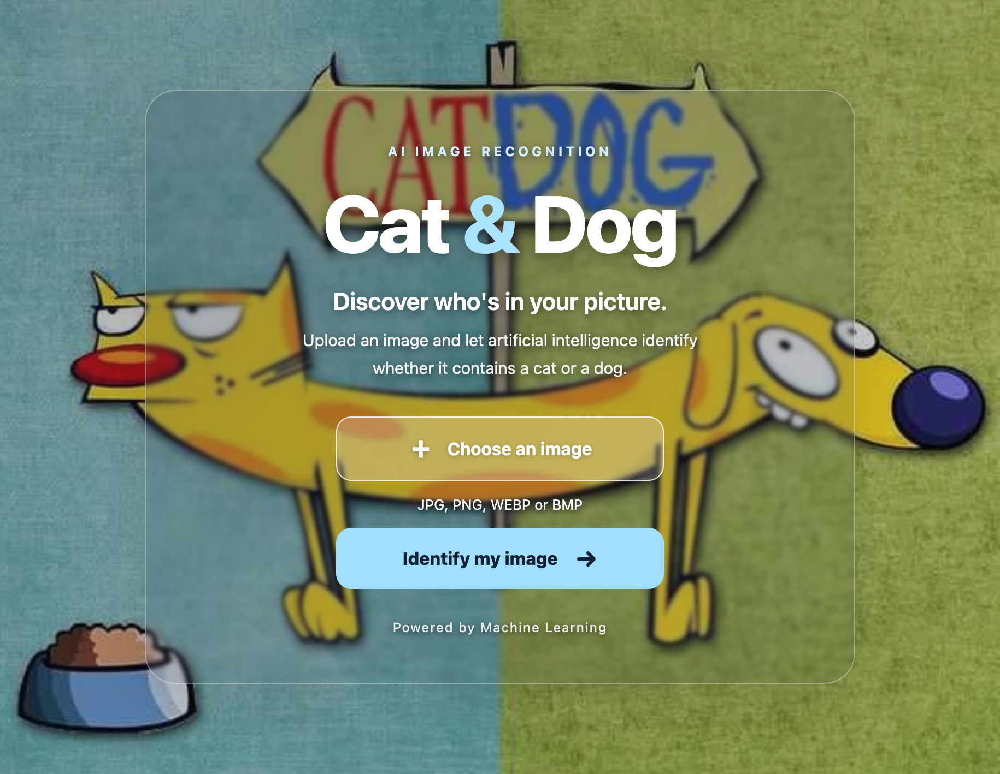
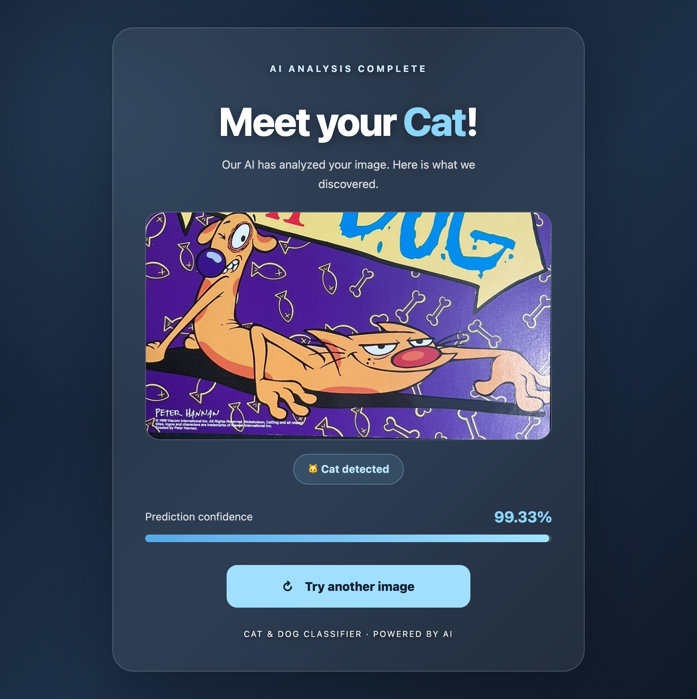
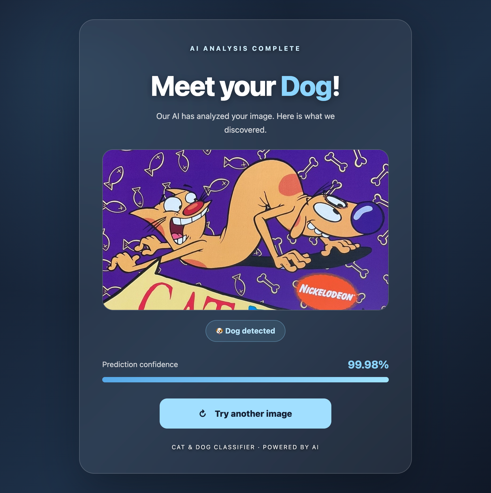

# 🐱🐶 Cat & Dog Classifier

A deep learning web application that classifies images as either a cat or a dog. Built with Python and Flask, this project combines an image classification model with a simple and user-friendly web interface.

## ✨ Features

* 🖼️ Upload an image for classification.
* 🧠 Predict whether an image contains a cat or a dog.
* 📊 Display the prediction confidence, if provided by the model.
* 🎨 Custom interface with a background image and styled result pages.
* 🧩 Separate image classification logic from the Flask web application.

## 🛠️ Technologies

* Python
* Flask
* TensorFlow / Keras
* HTML5
* CSS3

## 🔗 Project Links

* **GitHub Repository:** [Flask AI Cat or Dog](https://github.com/Sardor-Tozhiyev/Flask_AI_cat_or_dog)
* **Google Colab Notebook:** [Open the notebook](https://colab.research.google.com/drive/1cJHErhU0bh4UjeosQZZC5PodMa2fa0Gw?usp=sharing)
* **Dataset:** Add the link to the dataset used to train the model.

## 📸 Application Screenshots

### 🏠 Home Page

The main page allows users to upload an image for classification.



### 🐱 Cat Classification

An example of the application classifying an uploaded image as a cat.



### 🐶 Dog Classification

An example of the application classifying an uploaded image as a dog.



## 📁 Project Structure

```text
Flask_AI_cat_or_dog/
├── static/
│   ├── images/
│   │   ├── cat_dog.jpeg
│   │   ├── cat.jpg
│   │   ├── dog.jpg
│   │   ├── homepage.png
│   │   ├── meet_your_cat.png
│   │   └── meet_your_dog.png
│   ├── models/
│   │   └── cat_dog_classifier.keras
│   ├── uploads/
│   └── styles.css
├── templates/
│   ├── index.html
│   └── result.html
├── app.py
├── classifier.py
├── requirements.txt
├── .gitignore
└── README.md
```

## ⚙️ Installation and Setup

### 1. Clone the repository

```bash
git clone https://github.com/Sardor-Tozhiyev/Flask_AI_cat_or_dog.git
cd Flask_AI_cat_or_dog
```

### 2. Create a virtual environment

```bash
python3 -m venv .venv
```

Activate the virtual environment on macOS or Linux:

```bash
source .venv/bin/activate
```

### 3. Install dependencies

```bash
pip install -r requirements.txt
```

### 4. Check the trained model

Make sure the trained model is available at:

```text
static/models/cat_dog_classifier.keras
```

If the model is not included in the repository, download it separately and place it at the path expected by the application.

### 5. Run the application

```bash
python app.py
```

Open the local URL displayed in the terminal. With the default Flask configuration, it is usually:

http://127.0.0.1:5000

## 🚀 How to Use

1. Open the application in your browser.
2. Select an image from your computer.
3. Submit the image for classification.
4. View the predicted class: cat or dog.
5. Check the prediction confidence if it is displayed.
6. Upload another image to test the classifier.

## 🧠 Model Training

The model training workflow is available in the Google Colab notebook.

[Open the Cat & Dog Classifier notebook in Google Colab](https://colab.research.google.com/drive/1cJHErhU0bh4UjeosQZZC5PodMa2fa0Gw?usp=sharing)

The notebook can be used to review the training process, model evaluation, and prediction examples. Make sure its sharing permissions allow reviewers to access it.

## 📝 Notes

* This project demonstrates image classification using deep learning and Flask.
* Prediction quality depends on the trained model and the input image.
* The trained model must be available at the configured path for the application to run.
* Only image formats supported by the application should be uploaded.

## 👨‍💻 Author

**Sardor Tozhiyev**

A Python and machine learning project demonstrating image classification with a Flask web interface.
